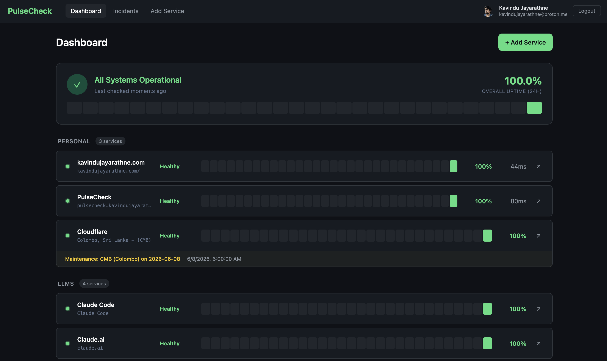
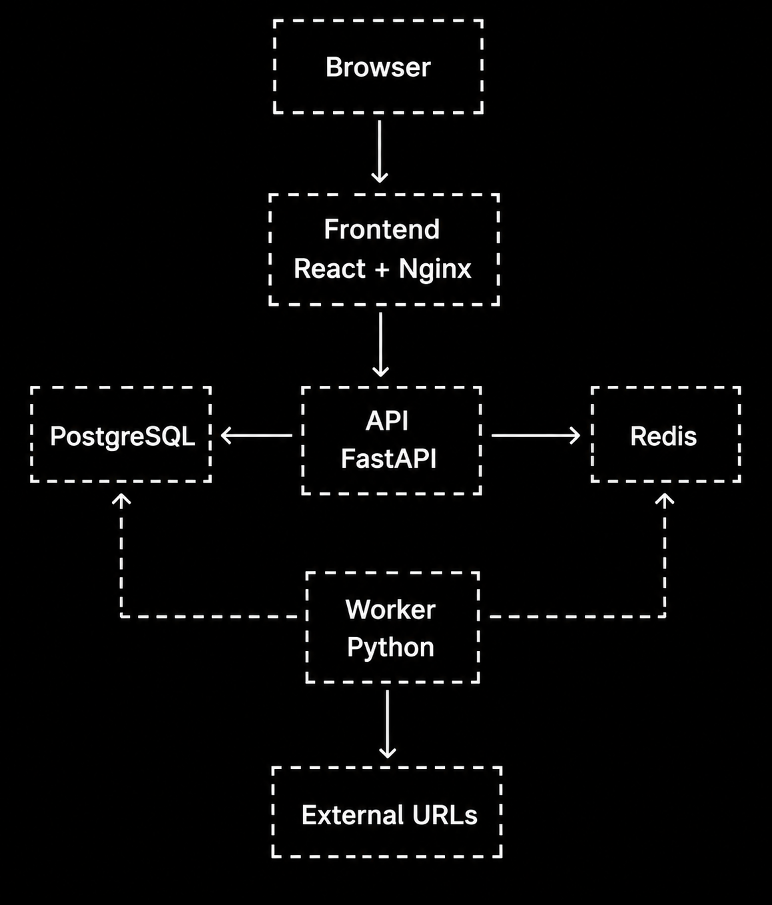

# PulseCheck



A self-hosted, multi-user service monitoring dashboard. PulseCheck monitors services either by actively pinging HTTP endpoints (measuring uptime, response time, and incidents at configurable intervals) or by parsing public status pages to read component status, incidents, and scheduled maintenances that the service publishes itself. Each user gets their own dashboard with services organized by custom categories.

On the other hand, PulseCheck is a reference environment.

> [!NOTE]
> "reference environment" - a stable, real deployment that I keep using as the foundation for
> ongoing experimentation. Not a project with a finish line. Not a sandbox that I throw away. A
> persistent, real environment that doubles as a lab.

To read more, refer to the [journal](http://kavindujayarathne.com/blogs/pulsecheck-journal).

## Usage

1. Sign in with Google or GitHub.
2. Add a service to monitor in one of two modes:
   - **HTTP ping**: enter the URL, expected status code, and optional latency thresholds. PulseCheck checks the endpoint on the interval you configure.
   - **Status page**: enter a public status page URL. PulseCheck discovers and validates its public API, then asks you to pick the component(s) you want to track.
3. Organize services into custom categories.
4. The dashboard shows live status, uptime, latency, and recent activity for each service.
5. Click a service to view its response time history, uptime over time, and incident timeline.

## Architecture

<p align="center">
  
</p>

## Tech Stack

| Service    | Tech                       | Purpose                                    |
|------------|----------------------------|--------------------------------------------|
| Frontend   | React + Vite + Nginx       | Dashboard UI                               |
| API        | Python FastAPI             | REST endpoints, auth, data serving         |
| Worker     | Python                     | Pings endpoints, monitors status pages, records results    |
| PostgreSQL | PostgreSQL 16              | Stores services, checks, incidents, users  |
| Redis      | Redis 7                    | Caches latest status; throttles status page fetches        |


## Iterations

The project is built in iterative phases. Each sub-iteration is a coherent unit of work shipped in a single commit.

### Main Iteration 1: Docker / Kubernetes Automation

- Sub-Iteration 1: Project Structure with Docker Compose Setup
- Sub-Iteration 2: Network Segmentation in Docker Compose
- Sub-Iteration 3: Database Schema and Migrations
- Sub-Iteration 4: OAuth Authentication with GitHub and Google
- Sub-Iteration 5: API Endpoints for Services and Incidents
- Sub-Iteration 6: Worker Health Check Logic
- Sub-Iteration 7: Frontend Dashboard and Pages
- Sub-Iteration 8: Status Page Monitoring
- Sub-Iteration 9: Production Docker Hardening
- Sub-Iteration 10: Local Kubernetes Deployment via kind (multi-node showcase)
- Sub-Iteration 11: Local Kubernetes Operations with kind (multi-node showcase)
- Sub-Iteration 12: VPS K3s Deployment with Cloudflare Proxy and Let's Encrypt TLS
- Sub-Iteration 13: CI/CD with GitHub Actions

### Main Iteration 2: Advanced Infrastructure

Coming soon.

## Environments

The same application code runs across four layers. Each has its own purpose, tooling, hostname, OAuth apps, and secrets file, and each gets a security posture appropriate to where it runs. The three Kubernetes layers additionally share one Helm chart.

| Environment | Tool | Hostname | Image source | Values file | Secrets file |
|---|---|---|---|---|---|
| **Dev** | Docker Compose | `http://localhost:3000` | local build (`target: dev`) | `.env` | `.env` |
| **Kind** (multi-node showcase) | kind (4 nodes) | `http://pulsecheck.com` | local build (`target: prod`), side-loaded into kind | `helm/pulsecheck/values.yaml` | `helm/pulsecheck/values-secrets.yaml` |
| **Local-prod** (single-node pre-deploy test) | k3d (single-node K3s in Docker) | `http://pulsecheck.kavindujayarathne.io:8080` | local build (`target: prod`), imported into k3d | `values-production.yaml` + `values-production-local.yaml` | `values-secrets-production-local.yaml` |
| **Real prod** | K3s on VPS | `https://pulsecheck.kavindujayarathne.com` | GHCR (pulled by K3s) | `values-production.yaml` | `values-secrets-production.yaml` |

Hostnames `pulsecheck.com` (kind) and `pulsecheck.kavindujayarathne.io` (k3d local-prod) resolve to `127.0.0.1` locally via `/etc/hosts`. The real prod hostname `pulsecheck.kavindujayarathne.com` is intentionally **not** in `/etc/hosts`: it resolves through real DNS to Cloudflare's edge IPs, so typing the prod URL on the laptop reaches the actual production site. Local-prod uses a distinct top-level domain (`.io`) so its `/etc/hosts` entry never hijacks the real prod hostname. Kind binds port 80, k3d binds port 8080, so both local clusters can run simultaneously without collision.

### Dev (Docker Compose)

The daily development loop. `docker-compose.yml` builds every service at `target: dev` with source mounted for hot reload. The dev hostname is `localhost`; the Vite dev server proxies `/api/*` to the api container. Two bridge networks (`web`, `data`) segment traffic: only api and frontend share `web`; postgres and redis live on `data` and are unreachable from the browser-facing network.

**Security posture (image-level hardening, applies in every layer downstream too):**

- Multi-stage Dockerfiles with `python:3.12-slim` and `node:22-alpine` minimal bases; dependencies built in an isolated stage and copied as a non-root user prefix
- All app containers run as a dedicated non-root user (`uid 1000`); frontend prod image uses `nginxinc/nginx-unprivileged` and listens on `8080`
- Image labels (`org.opencontainers.image.source`) wired for GHCR provenance
- Secrets injected via env vars from a gitignored `.env`; nothing baked into images

### Kind (multi-node showcase)

A local 4-node Kubernetes cluster used as the multi-node showcase, never for daily development. Topology:

- 1 control plane (no application pods)
- 2 app workers (`role=app`) hosting the application Deployments and the StatefulSet
- 1 dedicated edge worker (`role=edge`) running only ingress-nginx, isolated via a `NoSchedule` taint

The multi-node configuration lives in `k8s/kind-config.yaml`, `helm/ingress-nginx/values-kind.yaml`, and `k8s/coredns-patch.yaml` - kind-only files, never used in local-prod or real-prod. HPA is enabled here (multi-node makes CPU-based scale-out meaningful), and `TopologySpreadConstraints` distribute pods across the two app workers.

**Security posture (in addition to the Helm chart baseline below):**

- Edge isolation: ingress-nginx is the only workload tolerating the `role=edge` taint, so a compromised app pod can't be co-scheduled onto the ingress node
- NetworkPolicies enforced cluster-wide via the chart's default-deny baseline plus per-component allow rules
- App pods pinned to `role=app` nodes via nodeSelectors

### Local-prod (k3d, single-node)

k3d (K3s in Docker) running a single-node cluster that mirrors the real-prod environment. Used as the last pre-deploy gate: any change goes through local-prod before it's allowed near the VPS. Reuses `values-production.yaml` and layers `values-production-local.yaml` on top to swap the hostname and disable TLS/cert-manager (local doesn't need Let's Encrypt). Multi-node scheduling rules from the chart degrade gracefully on a single node thanks to `whenUnsatisfiable: ScheduleAnyway`.

**Security posture:** inherits the full real-prod posture (same base values file, same chart, same pod security defaults). The only intentional drop is TLS/cert-manager, since local-prod has no public DNS to satisfy an ACME challenge.

### Real prod (K3s on VPS)

The public-facing production deployment on a single-node K3s cluster running on a VPS. Images come from GHCR (not local builds), pulled by K3s at deploy time. Hostname is `pulsecheck.kavindujayarathne.com`, fronted by Cloudflare.

**Security posture (most layered of all four):**

- **Cloudflare proxy ON** + VPS provider firewall locked to Cloudflare's published IP ranges, so the VPS's `:80`/`:443` are unreachable from anywhere except CF edge
- **TLS via Let's Encrypt** through cert-manager (HTTP-01 challenge, ClusterIssuer `letsencrypt-prod`). Staging issuer also installed for dry runs to avoid LE rate limits
- **Real client IP preservation:** ingress-nginx configured with `use-forwarded-headers`, `real-ip-header: CF-Connecting-IP`, and `proxy-real-ip-cidr` restricted to Cloudflare's IPv4 + IPv6 ranges, so the app sees the actual visitor IP, not Cloudflare's edge IP, and headers from outside CF can't spoof it
- **Resource limits** in `values-production.yaml` sized conservatively for a small VPS, with caps on every pod so no single workload can starve the cluster
- **HPA disabled** (single-node K3s; nothing to scale across), `replicas: 1` everywhere

## Deployment & Automation

How code moves from a local edit to each layer above. The Helm chart is the unit of deployment for the three Kubernetes layers; `Makefile` and `Makefile.prod` are the entry points.

### Helm chart (`helm/pulsecheck/`)

One chart, three Kubernetes layers (kind, local-prod k3d, real-prod K3s). The chart contains:

- **Deployments** for frontend (Nginx + static SPA), api (FastAPI), worker, and redis
- **StatefulSet** for postgres backed by a PersistentVolumeClaim
- **Services** for each component (ClusterIP)
- **Ingress** routing `/api/*` to the api Service and `/*` to the frontend Service
- **Secret** for OAuth credentials, JWT signing key, and database password
- **ConfigMap** for non-sensitive runtime configuration
- **NetworkPolicies** enforcing a default-deny baseline with explicit per-component allow rules
- **HorizontalPodAutoscaler** for the api Deployment (CPU-based; enabled in kind, disabled in real-prod and local-prod since both run single-node)
- **TopologySpreadConstraints** distributing pods across nodes (`whenUnsatisfiable: ScheduleAnyway` so single-node clusters degrade to no-op)
- **Init containers** ensuring postgres and redis are ready before api and worker start

**Shared pod-security baseline** across every workload in every Kubernetes layer: non-root execution, dropped Linux capabilities, no privilege escalation, seccomp `RuntimeDefault`, read-only root filesystem where the runtime supports it. Layer-specific security (edge taint, Cloudflare + VPS provider firewalling, Let's Encrypt) is documented per-layer above.

### Make targets

`Makefile` is the kind layer's automation. `Makefile.prod` covers the local-prod and real-prod layers.

| Layer | Target | Description |
|---|---|---|
| Kind | `make cluster-up` | Create the Kind cluster and deploy the full app |
| Kind | `make cluster-down` | Destroy the Kind cluster |
| Kind | `make cluster-pause` / `cluster-resume` | Stop / restart node containers without destroying state |
| Kind | `make build-images` / `load-images` / `deploy` / `redeploy` | Targeted image and chart operations |
| Local-prod | `make -f Makefile.prod local-prod-up` | Create k3d cluster, build+import images, helm install |
| Local-prod | `make -f Makefile.prod local-prod-down` | Destroy the k3d cluster |
| Local-prod | `make -f Makefile.prod local-prod-deploy` | Rebuild, reload, helm upgrade (cluster already exists) |
| Local-prod | `make -f Makefile.prod local-prod-build` / `local-prod-load` | Build prod images with the current `VERSION` tag and import them into the k3d cluster (standalone sub-steps of `local-prod-up`) |
| Real prod | `make -f Makefile.prod build-images` / `push-images` / `release` | Build and dual-tag images (semver + git SHA), push to GHCR; `release` refuses on a dirty tree |
| Real prod | `make -f Makefile.prod bootstrap-prod` | One-time cluster bootstrap: install ingress-nginx, cert-manager, ClusterIssuers |
| Real prod | `make -f Makefile.prod deploy-prod` | Helm upgrade against the VPS K3s cluster (pins the current SHA tag) |
| Real prod | `make -f Makefile.prod rollback-prod` / `logs-prod` | Rollback to the previous Helm revision or tail logs from all app pods |
| Real prod | `make -f Makefile.prod print-tags` | Print the semver and SHA tags that would be applied to the next build |

### Versioning

Centralised on `helm/pulsecheck/Chart.yaml` `appVersion` as the single source of truth. Both Makefiles read it dynamically, image tags inherit from it, and Helm `--set <component>.image.tag=$(VERSION)` injects it at install time.

### `docker-compose.prod.yml`

A separate override file that flips each Compose build to `target: prod` and clears dev mounts/ports. It is **not** used to produce the images for kind or production deployments (those come from `make build-images` calls directly invoking `docker build --target prod`); it exists only as an optional local sanity-check tool to run the prod-target images end-to-end without Kubernetes.

## Project Structure

```
.
├── api/                              # FastAPI backend
├── worker/                           # Background health checker
├── frontend/                         # React dashboard (Vite dev / Nginx prod)
├── db/                               # Shared SQLAlchemy models (used by api + worker)
├── parsers/                          # Status page parsers (used by api + worker)
├── assets/                           # README images (architecture diagram, etc.)
├── helm/                             # Helm-related files
│   ├── pulsecheck/                   # Pulsecheck Helm chart
│   │   ├── Chart.yaml                # Chart + app version (single source of truth)
│   │   ├── templates/                # K8s manifests (shared across kind, local-prod, real-prod)
│   │   ├── values.yaml               # Kind layer values
│   │   ├── values-production.yaml    # Real-prod values (standalone)
│   │   ├── values-production-local.yaml  # Local-prod overrides on top of values-production.yaml
│   │   └── values-secrets.example.yaml   # Template for the gitignored secrets files
│   ├── ingress-nginx/                # Values for the upstream ingress-nginx chart
│   │   ├── values-kind.yaml          # Kind layer (node selector + edge taint tolerations)
│   │   └── values-production.yaml    # Real-prod (hostPort + Cloudflare IP trust)
│   └── cert-manager/                 # Values for the upstream cert-manager chart
│       └── values.yaml               # Real-prod only (cert-manager not used in kind/local-prod)
├── k8s/                              # Cluster-setup files + raw K8s manifests
│   ├── kind-config.yaml              # Kind 4-node cluster definition
│   ├── k3d-config.yaml               # k3d single-node cluster config (local-prod)
│   ├── coredns-patch.yaml            # CoreDNS scheduling patch (kind only)
│   └── cert-manager/
│       └── clusterissuer.yaml        # Let's Encrypt ClusterIssuer (staging + prod)
├── Makefile                          # Kind layer automation
├── Makefile.prod                     # Local-prod + real-prod automation
├── docker-compose.yml                # Dev stack
├── docker-compose.prod.yml           # Local prod-image sanity check (optional)
└── .env.example                      # Environment variable template
```
